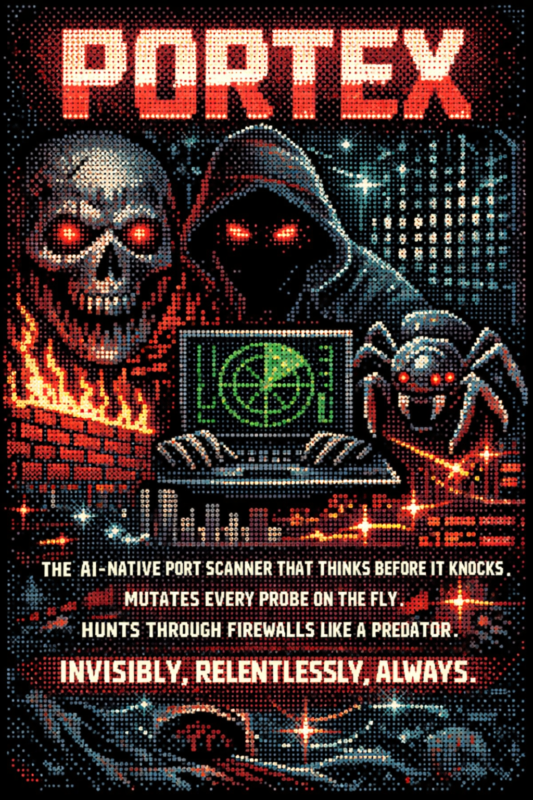

<div align="center">
  

  <h1>PORTEX</h1>

  <p><strong>The AI-native port scanner that thinks before it knocks.<br>
  Mutates every probe on the fly. Hunts through firewalls like a predator.<br>
  Invisibly, relentlessly, always.</strong></p>

  <p>
    <a href="https://github.com/m4rvxpn/portex/actions"></a>
    <a href="go.mod"></a>
    <a href="LICENSE"></a>
    <a href="docs/"></a>
  </p>
</div>

## What is Portex?

Portex is a high-performance, AI-augmented port scanner written in Go. It replicates nmap's complete scanning architecture — all 13 scan types, service detection, OS fingerprinting, and NSE-equivalent Lua scripting — while adding five AI layers that make every scan adaptive, evasive, and enriched.

**Why not just use nmap?**

| Feature | nmap | Portex |
|---|---|---|
| Concurrent probes | ~500 (threads) | 5000 (goroutines) |
| Packet construction | libdnet/C | gopacket (zero-copy, sync.Pool) |
| Adaptive probe logic | Static | RL agent (ONNX/heuristic) |
| Firewall evasion | Manual flags | Automatic payload mutation + mimicry |
| Output | XML / grepable | JSON, BBOT NDJSON, nuclei YAML, CSV, XML |
| Post-scan enrichment | Scripts | LLM (Claude / Ollama) |
| Pipeline integration | None | bbot / phantom-easm native |


## Five AI Layers

```
Probe dispatch
    │
    ├─ Layer 1: RL Probe Optimizer   → selects flags, TTL, source port per target state
    ├─ Layer 2: Payload Mutator      → fragments, pads, shifts urgent pointer, source-routes
    ├─ Layer 3: Protocol Obfuscation → QUIC, DNS-tunnel, IPv6 ext-hdr, ICMP covert
    ├─ Layer 4: Traffic Mimicry      → per-OS window sizes, TTL spoofing, decoy flood
    │
    └─ Raw socket → target
           │
           └─ Layer 5: LLM Enrichment  → CVE lookup, nuclei template gen, vuln summary
```


## Quick Start

### Prerequisites

```bash
# Debian/Ubuntu/Kali
sudo apt-get install -y libpcap-dev

# Arch
sudo pacman -S libpcap

# Go 1.22+
go version
```

### Build

```bash
git clone https://github.com/m4rvxpn/portex
cd portex
make build          # → bin/portex
```

### First scan

```bash
# Basic SYN scan of a host (requires root for raw sockets)
sudo ./bin/portex scan -t 192.168.1.1 -p 1-1024 --mode syn

# Top 1000 ports with service detection
sudo ./bin/portex scan -t 192.168.1.0/24 -p top1000 --mode syn --service-detect

# Full stealth mode with all AI layers
sudo ./bin/portex scan -t 192.168.1.1 -p top1000 --mode stealth \
  --rl --mutate --mimic --llm --output bbot,json,nuclei-yaml
```


## Scan Modes

| Flag | Mode | Description |
|---|---|---|
| `--mode syn` | SYN stealth | Half-open TCP, fastest, least logged |
| `--mode connect` | TCP connect | Full handshake, no raw socket needed |
| `--mode ack` | ACK probe | Firewall rule mapping |
| `--mode fin` | FIN probe | Evades simple stateless filters |
| `--mode xmas` | XMAS | FIN+PSH+URG, RFC 793 behavior |
| `--mode null` | NULL | No TCP flags |
| `--mode window` | Window | RST window size interpretation |
| `--mode maimon` | Maimon | FIN+ACK, BSD-specific |
| `--mode udp` | UDP | Service detection via ICMP unreachable |
| `--mode sctp` | SCTP INIT | SCTP stack fingerprinting |
| `--mode ipproto` | IP Protocol | Supported IP protocols |
| `--mode idle` | Idle/Zombie | Truly blind scan via zombie host |
| `--mode stealth` | Stealth | RL-selected mode per port/RTT |


## Usage Reference

### CLI flags

```
portex scan [flags]

Targeting:
  -t, --targets string    IPs, CIDRs, hostnames (comma-sep or @file)
  -p, --ports string      port spec: 80,443 | 1-1024 | top100 | top1000 | all

Scan control:
  --mode string           scan mode (see table above, default: syn)
  --timing int            T0-T5 paranoid→insane (default: 3)
  --goroutines int        concurrent probes (default: 5000)
  --max-retries int       per-port retry limit (default: 6)
  --zombie string         host:port for idle scan (--mode idle)

Detection:
  --service-detect        banner grab + nmap-service-probes matching
  --os-detect             OS fingerprinting via TTL/window heuristics
  --script-scan           run bundled Lua scripts
  --scripts string        comma-sep script names (default: all)

AI layers:
  --rl                    RL probe optimizer (Layer 1)
  --mutate                payload mutation (Layer 2)
  --mimic                 traffic mimicry (Layer 4)
  --llm                   LLM enrichment (Layer 5)
  --llm-provider string   claude | ollama (default: claude)

Output:
  --output string         formats: json,bbot,xml,csv,nuclei-yaml (comma-sep)
  --output-file string    base path for output files
  --session-id string     phantom pipeline session correlation ID

Network:
  --proxy string          socks5://host:port or http://host:port
  -v, --verbose           verbose logging
```

### Examples

```bash
# Idle scan using zombie host (truly blind)
sudo ./bin/portex scan -t 10.0.0.5 -p 80,443,8080 --mode idle --zombie 10.0.0.3:80

# OS detection + scripts on specific ports
sudo ./bin/portex scan -t 10.0.0.1 -p 22,80,443 \
  --service-detect --os-detect --script-scan --scripts http-title,ssl-cert

# Full AI-powered stealth recon → bbot + nuclei templates
sudo ./bin/portex scan -t 10.0.0.0/24 -p top1000 --mode stealth \
  --rl --mutate --mimic --llm \
  --output bbot,json,nuclei-yaml --output-file ./results/target

# Proxy-aware (SOCKS5 via phantom-easm)
SOCKS5_PROXY=socks5://127.0.0.1:1080 \
  sudo -E ./bin/portex scan -t 10.0.0.1 -p 443 --mode connect

# REST API server
sudo ./bin/portex serve --bind 0.0.0.0:8080 --api-key $(openssl rand -hex 32)
```


## REST API

```
POST   /v1/scan              start async scan → returns scan_id
GET    /v1/scan/:id          get scan status
GET    /v1/scan/:id/results  stream results (SSE or JSON array)
DELETE /v1/scan/:id          cancel scan
POST   /v1/scan/sync         synchronous scan (60s timeout)
GET    /v1/health            liveness probe
GET    /metrics              Prometheus metrics
```

Request body:
```json
{
  "targets": ["10.0.0.1/24"],
  "ports": "top1000",
  "mode": "syn",
  "enable_rl": true,
  "enable_llm": false,
  "output_formats": ["bbot", "json"],
  "session_id": "phantom-abc123"
}
```


## bbot Integration

Portex emits BBOT-native NDJSON events — drop it into any bbot pipeline:

```jsonc
// Open port discovered
{"type":"OPEN_TCP_PORT","data":{"host":"10.0.0.1","port":443,"proto":"tcp","status":"open","service":"https","version":"nginx/1.25.0"},"module":"portex","scan_id":"..."}

// Technology identified
{"type":"TECHNOLOGY","data":{"host":"10.0.0.1","port":443,"tech":"nginx","version":"1.25.0","cpe":"cpe:/a:nginx:nginx:1.25.0"},"module":"portex"}

// Vulnerability (LLM-enriched)
{"type":"VULNERABILITY","data":{"host":"10.0.0.1","port":443,"severity":"high","cves":["CVE-2023-44487"],"summary":"HTTP/2 Rapid Reset DoS"},"module":"portex"}
```

Events carry deterministic UUID v5 IDs keyed on `(type, host, port)` for dedup in the phantom data-router.


## LLM Enrichment

Set `ANTHROPIC_API_KEY` for Claude, or point at a local Ollama instance:

```bash
# Claude (default)
export ANTHROPIC_API_KEY=sk-ant-...
sudo -E ./bin/portex scan -t 10.0.0.1 -p top100 --llm

# Ollama (local, no API key)
sudo ./bin/portex scan -t 10.0.0.1 -p top100 --llm --llm-provider ollama
```

For each open port, the LLM returns:
- CVEs affecting the detected service/version
- Attack surface summary
- Exploitation guidance for the context
- Ready-to-use nuclei YAML template


## Docker

```bash
# Build
docker build -t portex:latest .

# Run (NET_RAW + NET_ADMIN required for raw sockets)
docker run --rm --cap-add NET_RAW --cap-add NET_ADMIN --network host \
  -e ANTHROPIC_API_KEY=$ANTHROPIC_API_KEY \
  portex:latest scan -t 10.0.0.1 -p top1000 --mode syn
```


## Build & Test

```bash
make build          # compile → bin/portex
make build-static   # CGO_ENABLED=0 static binary (no libpcap)
make test           # unit tests (-short, no root)
make lint           # golangci-lint
make vet            # go vet
make docker         # docker build

# Integration tests (requires root)
sudo make test-integration
```


## Documentation

Full wiki in [`docs/`](docs/):

| Document | Contents |
|---|---|
| [Architecture](docs/architecture.md) | Internals, concurrency model, AI pipeline |
| [Installation](docs/installation.md) | Dependencies, build options, Docker |
| [Scan Modes](docs/scan-modes.md) | Every mode explained with packet-level detail |
| [AI Layers](docs/ai-layers.md) | RL agent, mutator, mimicry, LLM enrichment |
| [Output Formats](docs/output-formats.md) | JSON, BBOT, XML, CSV, nuclei YAML |
| [REST API](docs/rest-api.md) | Endpoint reference, auth, SSE streaming |
| [bbot Integration](docs/bbot-integration.md) | Phantom-easm pipeline wiring |
| [Configuration](docs/configuration.md) | All flags, env vars, config file format |
| [Use Cases](docs/use-cases.md) | Red team, bug bounty, asset inventory, EASM |


## Legal

Portex is for authorized security testing only. Use against systems you own or have explicit written permission to test. The authors accept no liability for misuse.
